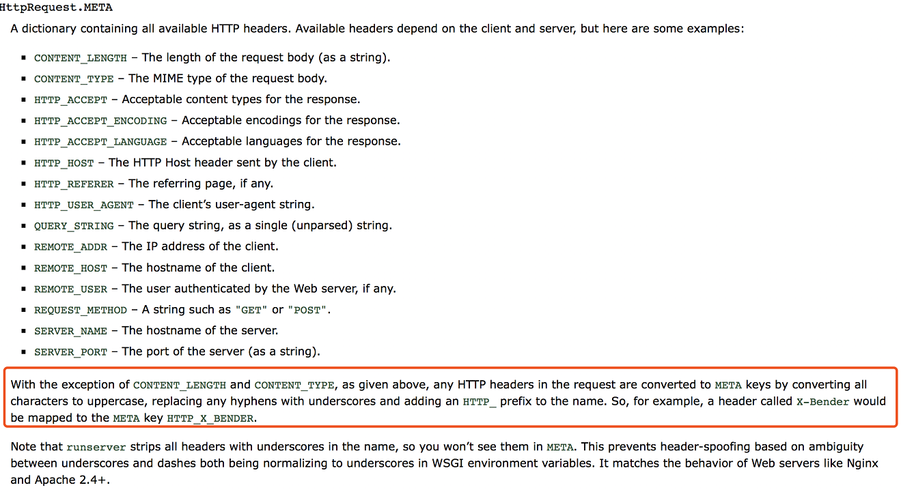

# By 2019/6/12

框架|问题|原因|跳转
---|---|---|---
Django|request.META.get()获取不到信息|nginx在处理时会自己加上http|[1](#1)

# 1
### Django-request.META.get()获取不到信息
> 发送方
```python
# 注意DJANGO META中的_要用-处理
headers = {
    'XXX-TOKEN': token
}
res = requests.get(url=api_url, headers=headers, params=params)
```
> 接收方
```python
if request.META.get('HTTP_XXX_TOKEN') != settings.RISK_TOKEN:
    return HttpResponse('INVALID TOKEN !', status=401)
```

