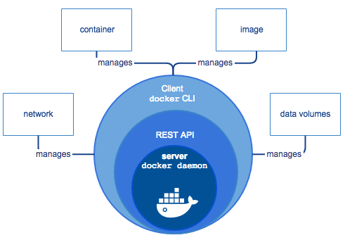
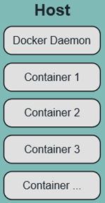
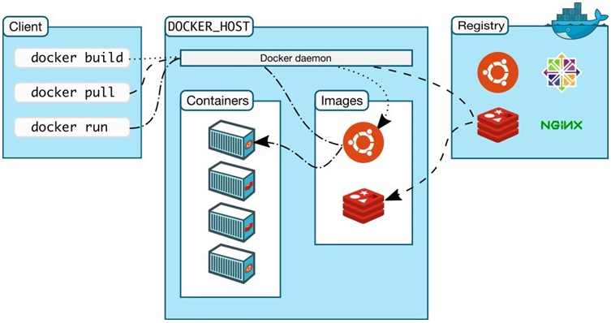

# Docker概念
### Docker Engine+docker hub = docker platform   
> docker引擎是一个c/s结构的应用， 是一个基于虚拟化技术的轻量级并且功能强大的开源容器引擎管理工具。   
> 它可以将不同的 work flow 组合起来构建成你的应用   


### Docker Daemon(服务端)
```
Docker架构中常驻后台的系统进程，是一个服务进程，负责接收处理用户发送的请求和管理所有的Docker容器
```
> 所谓的运行Docker即代表运行Docker Daemon。
### Docker Client(客户端)
```
Docker架构中用户与Docker Daemon建立通信的客户端。
```
> 扮演着docker服务端的远程控制器，可以用来控制docker的服务端进程。   
> 大部分情况下，docker服务端和客户端运行在一台机器上。   
---
* Docker内部构建
   * Docker 镜像 - Docker images
   ```
       docker pull     //从网络上下载镜像
       docker images  //查看本地主机已经存在的镜像 
   ```
   > 镜像=操作系统+软件运行环境+用户程序

   * Docker 仓库 - Docker registeries

   * Docker 容器 - Docker containers
   > runtime用docker image来创建Docker容器，一个镜像可以创建很多容器   
 
---
* DockerFile
   > DockerFile是包含若干命令的文本文件，可以通过它来创建出docker image
* Docker Compose
   > Docker Compose是Docker容器进行编排的工具，定义和运行多容器的应用，可以一条命令启动多个容器。
   1. (文件)Dockerfile 定义应用的运行环境
   2. (文件)Docker-compose.yml 定义组成应用的各服务
   3. (命令)Docker-compose up 启动整个应用
