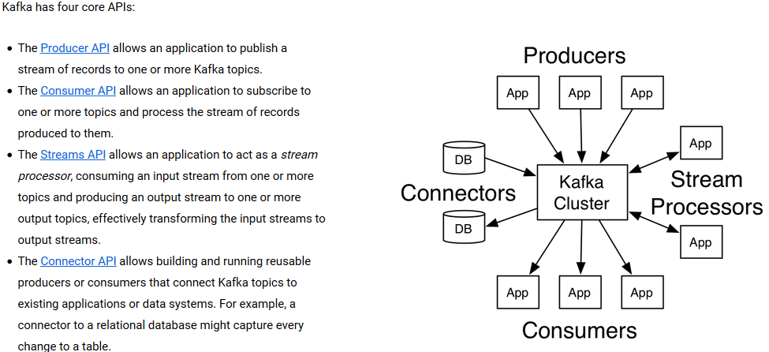

# Kafka

* [概念](#概念)
* [使用](#使用)

# 概念

### Kafka核心组件
* Topic：消息根据Topic进行归类，可以理解为一个队里   
* Producer：消息生产者   
> 向kafka broker发消息的客户端   
* Consumer：消息消费者   
> 向kafka broker取消息的客户端   
* broker：每个kafka实例(server)   
> 一台kafka服务器就是一个broker，一个集群由多个broker组成，一个broker可以容纳多个topic   
* Zookeeper：依赖集群保存meta信息   

### Kafka集群运行在一个或多个可以跨多个数据中心的服务器上
* 这句话表达了三个意思：
    * Kafka是以集群方式运行的
    * 集群中可以只有一台服务器，也有可能有多台服务器。
    > 一台服务器是一个集群，多台服务器也可以组成一个集群
    * 这些服务器可以跨多个数据中心

### Each record consists of a key, a value, and a timestamp
---

(发布、订阅、转换处理、从第三方采集数据)
---
# 使用
