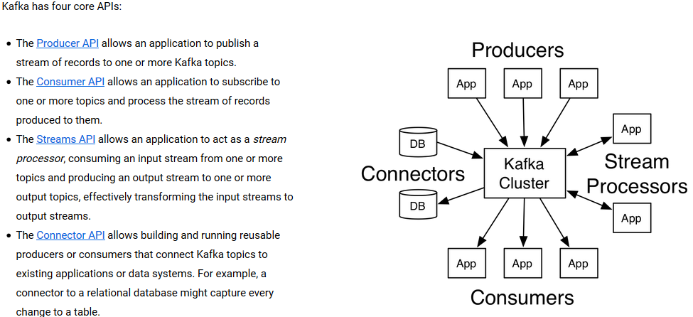

# Kafka

* [概念](#概念)
* [使用](#使用)

# 概念

* Kafka核心组件
　　 * Topic：消息根据Topic进行归类，可以理解为一个队里   
　　 * Producer：消息生产者   
　　    > 向kafka broker发消息的客户端   
　　 * Consumer：消息消费者   
　　    > 向kafka broker取消息的客户端   
　　 * broker：每个kafka实例(server)   
　　    > 一台kafka服务器就是一个broker，一个集群由多个broker组成，一个broker可以容纳多个topic   
　　 * Zookeeper：依赖集群保存meta信息   

# 使用
