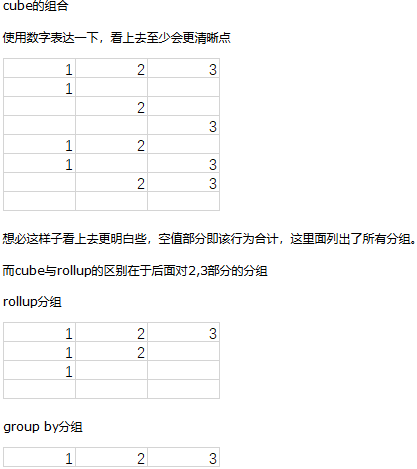

# ✦重要

classify|
---|
[mysql](#mysql)|

---
# mysql
* [sql执行顺序](#mysql执行顺序)
* [sql表连接](#mysql表连接)
* [sql排序](#mysql排序)

### mysql执行顺序
1. from
```
    对from的前两个表形成笛卡儿积, ✓选择相对小的表作为基础表
```

2. join

3. on
```
    先判断on: 将on中的逻辑表达式应用到基础表的各行，筛选出满足on的各行 →→→ 生成新表
    生成新表: 通过join类型过滤
             1.left join on x.id = xx.id
             2.right join on
             3.outer join
```

4. where
```
    where是所有on筛选后的下一步筛选
```

5. group by(某个唯一字段/下面的聚合函数)

6. avg,sum...(聚合函数)
```
    将唯一的值合成为一组,结果集中：每个组只有一行
```
> 如果有cube/rollup选项,则再次生成超组   

* cube(显示所选列中值的所有组合的聚合)
```
    group by rollup (xx_id,xx_xxx,xx_xxxx,...)
    
    Group By xx_id, xx_xxx, ...

    WITH Rollup Order By xx_id
```
* rollup(显示所选列中值的某一层次结构的聚合)

7. having(在聚合后对组记录进行筛选)
```
    SELECT xxx, xxxx, SUM(xxxxx)
    FROM xx
    GROUP BY xxx
    HAVING SUM(xxx...)>1000000   # 聚合条件
```

8. select

9. distinct

10. order by
> order by 返回的是一个游标,而不是一个虚拟表(很需要成本)

11. top ✦mysql不支持这个top操作,用limit吧
```
    SELECT TOP 2 * FROM xx
```

12. limit
```
    SELECT *
    FROM xx
    limit 10
    (limit 5,10)
    (limit 10,-1) -1→→→--last
```

### mysql表连接
1. left join
* 观察区别(and / where)
```
    SELECT * 
    FROM xx1 
    LEFT JOIN xx2 ON (xx1.id = xx2.id)
    AND xx2.id=2;
```
> 除了xx2.id=2的行有数据,其余行都为null →→→ 因为不符合on筛选
```
    SELECT * 
    FROM xx1 
    LEFT JOIN xx2 ON (xx1.id = xx2.id)
    Where xx2.id=2;
```
> 只筛选出了xx2.id=2的行

### mysql排序
MySQL的filesort有3种优化算法：
* 基本filesort
* 改进filesort
* In memory filesort
> 深入阅读
```
https://zm8.sm-tc.cn/?src=l4uLj8XQ0IiIiNGFipaSkJ2ekdGckJLQlZaekJyXmpGY0JKGjI6T0MfGy8nRl4uSkw==&uid=1865acafdb8c58e7601e66c9b7619d51&hid=93d01cf8eb74590bcf52910d9f269862&pos=3&cid=9&time=1491719166654&from=click&restype=1&pagetype=0000004000000402&bu=structure_web_info&query=mysql%E6%96%87%E4%BB%B6%E6%8E%92%E5%BA%8F%E5%8E%9F%E7%90%86&mode=&v=1&uc_param_str=dnntnwvepffrgibijbprsvdsdichei
```
```
The sort buffer has a size of sort_buffer_size. If the sort elements for N rows are small enough to fit in the sort buffer (M+N rows if M was specified), the server can avoid using a merge file and performs an in-memory sort by treating the sort buffer as a priority queue
也就是说，In memory filesort使用了优先级队列，而优先级队列的原理就是二叉堆。
```
